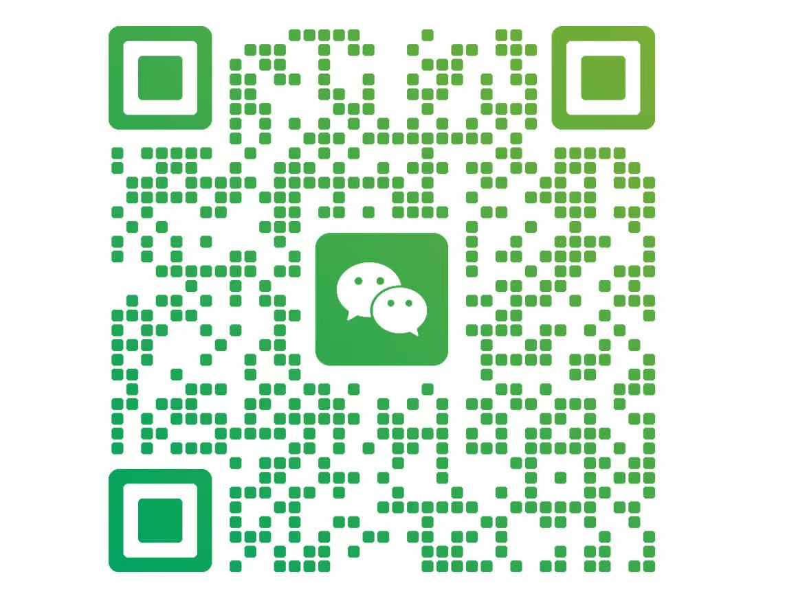

**English** | [中文](README.md)

<p align="center">
  
</p>

# Margin

**Highlight any webpage and ask AI in place.**

Margin is a local-first browser margin-note AI. Highlight text on a webpage, paper, GitHub issue, daily digest, or AI conversation, then ask a question in the page margin. Margin replies on the right side of the page, while notes, replies, and memory are stored on your own computer by default.

[Website](https://get-margin.vercel.app) · [Quick Start](#-quick-start) · [Features](#-features) · [Privacy](#-privacy) · [FAQ](#-faq)

---

## Why Margin?

| Capability | Margin | Regular AI chat | Traditional notes |
| --- | --- | --- | --- |
| Ask beside the source text | Yes | No, copy-paste required | Partial |
| Turn the webpage into chat context | Yes | No, context must be repeated | No |
| Store notes, replies, and memory locally by default | Yes | No | Partial |
| Learn from your corrections and working style | Yes | Partial | No |
| Turn follow-up questions into long-term context | Yes | No, often stuck in one chat | Partial |
| Reuse your previous judgments in future replies | Yes | Partial, platform-dependent | No |
| Review evidence and changes in a memory notebook | Yes | No | Partial |
| Support macOS / Windows / WSL | Yes | Yes | Yes |
| Optional Notion backup | Yes | No | Partial |
| Open source and inspectable | Yes | No | Partial |

---

## What problem does it solve?

Working with AI still has a context problem:

- You read something useful, then copy it into a chat box.
- You ask one question, then repeat the same background next time.
- Ideas, objections, and corrections scatter across tools.
- AI can answer well, but it often forgets why you cared.

Margin is built around one simple idea:

**AI should meet your thought where it appears.**

You stay on the current page. Highlight, comment, ask. Margin answers with the original webpage context, then saves those interactions into a local memory notebook.

---

## One-minute version

1. Open a webpage you are reading.
2. Highlight a sentence that makes you pause.
3. Write a comment that captures your curiosity, follow-up question, judgment, or feeling in that moment.
4. Margin replies on the right side and saves the source text, your comment, and the AI reply.
5. Later, AI can use that context instead of asking you to explain it again.

---

## Features

### Margin comments

Select text on any webpage and write a real question:

```text
Why does this matter?
```

Margin replies with the selected source text as context.

### Webpages become chat context

Margin does not save notes as isolated snippets. When you ask beside a passage, AI answers with that passage, the current page, and your comment in context.

### Memory from your working style

Comments, corrections, and follow-up questions are strong personal signals. Margin uses them to help AI gradually learn:

- what you are researching
- how you like explanations to be framed
- which judgments you keep repeating
- which rules should be reused next time

### Memory notebook

The local notebook runs at:

```text
http://localhost:8765/notebook/
```

Use it to review notes, AI replies, recent themes, project context, and emerging working habits.

### Optional Notion backup

Notion is optional. Margin uses local SQLite by default. You can choose to sync notes to your own Notion database as an external backup or legacy import source.

---

## Quick Start

### 1. Clone

```bash
git clone https://github.com/getupyang/knowledge-base-extension.git
cd knowledge-base-extension
```

### 2. Run setup

macOS / WSL:

```bash
bash setup.sh
bash start.sh
```

Windows PowerShell:

```powershell
.\setup.ps1
.\start.ps1
```

Windows CMD:

```bat
setup.cmd
start.cmd
```

The setup script lets you choose an AI backend:

| Option | Best for |
| --- | --- |
| Claude Code | Users already logged into Claude Code |
| Codex CLI | Users already using Codex CLI locally |
| Qwen API | Users with DashScope / Qwen API keys |
| OpenRouter API | Users with OpenRouter API keys |

### 3. Load the Chrome extension

1. Open `chrome://extensions`
2. Enable Developer Mode
3. Click "Load unpacked"
4. Select this repository root, the folder that contains `manifest.json`

When the Margin icon appears in the Chrome toolbar, open a webpage and start highlighting.

---

## Start Again Later

macOS / WSL:

```bash
bash start.sh
```

Windows PowerShell:

```powershell
.\start.ps1
```

Windows CMD:

```bat
start.cmd
```

The services are ready when you see:

```text
✓ Knowledge server: http://localhost:8765
✓ Agent API: http://localhost:8766
✓ Worker: PID xxxxx
```

---

## Privacy

Margin touches your reading, comments, follow-up questions, and corrections, so the default data model is deliberately conservative.

| Data | Default location | Notes |
| --- | --- | --- |
| Notes and AI replies | `~/.knowledge-base-extension/comments.db` | Local SQLite |
| Local backups | `~/.knowledge-base-extension/backups/` | Recovery snapshots, not cloud sync |
| Project context | `~/.knowledge-base-extension/project_context.md` | Private local file |
| User profile | `~/.knowledge-base-extension/user_profile.md` | Private local file |
| Secrets | `~/.kb_config` | Local config, not committed |
| Notion | Optional | Used only after you configure it |

Margin does not scan your full browser history by default. It trusts explicit actions such as highlighting, commenting, and correcting. Seeing a page is not the same as endorsing it, and it should not automatically become memory.

---

## Recent Updates

- **v0.3.12** — Supports selection comments on WeRead Web Reader pages, including canvas/custom selection flows.
- **Windows support** — PowerShell and CMD startup scripts are supported; WSL users should stay inside the WSL bash path.
- **Local-first notebook** — Local SQLite is the primary data source; Notion is optional backup and legacy import.

---

## Architecture

| Layer | Role |
| --- | --- |
| Chrome extension | Highlight detection, comment entry, right-side comment panel, popup |
| Content script | Injects page UI, manages selection, anchors, and comment cards |
| Agent API | Local backend, default port `8766` |
| Knowledge browser | Local reader and memory notebook, default port `8765` |
| Worker | Background jobs and memory growth |
| SQLite | Local notes, replies, and notebook data |
| Optional Notion | External backup and legacy import |

---

## FAQ

### Will I lose data if I do not configure Notion?

No. The primary database is local: `~/.knowledge-base-extension/comments.db`. Notion is only an optional external copy.

### Can I use Margin without Claude Code or Codex?

Yes. During setup, choose Qwen API or OpenRouter API.

### Why is AI not replying?

Check the local Agent API:

```bash
curl http://localhost:8766/health
```

If it fails, run the startup script again. Logs live at:

```text
~/.knowledge-base-extension/.logs/agent_api.log
```

On Windows:

```text
$HOME\.knowledge-base-extension\.logs\agent_api.log
```

### Extension changes do not show up. What should I do?

Open `chrome://extensions`, refresh Margin, then refresh the webpage that was already open.

### AI mentioned a project that is not mine. What should I check?

Check these local private context files:

```bash
cat ~/.knowledge-base-extension/project_context.md
cat ~/.knowledge-base-extension/user_profile.md
cat ~/.knowledge-base-extension/learned_rules.json
```

For a new user with an empty database, Margin should not borrow the developer's or another user's memory.

---

## Project Structure

```text
knowledge-base-extension/
├── manifest.json              # Chrome extension entry
├── setup.sh / start.sh        # macOS / WSL setup and startup
├── setup.ps1 / start.ps1      # Windows PowerShell entry
├── setup.cmd / start.cmd      # Windows CMD entry
├── src/
│   ├── content/               # Page injection, selection, comments UI
│   ├── background/            # Extension background worker
│   ├── popup/                 # Extension popup
│   ├── sidepanel/             # Side panel
│   └── notebook/              # Memory notebook frontend
├── backend/
│   ├── server.py              # Local knowledge browser, port 8765
│   ├── agent_api.py           # Local Agent API, port 8766
│   ├── worker.py              # Background worker
│   └── llm_client.py          # LLM provider adapter
└── scripts/
    ├── kb-health              # Local health check
    └── kb-regression          # Regression check
```

---

## Feedback

- Website: [https://get-margin.vercel.app](https://get-margin.vercel.app)
- Issues: [GitHub Issues](https://github.com/getupyang/knowledge-base-extension/issues)

If you run into installation, Windows, privacy, or local data issues, you can also scan the WeChat QR code below and mention `Margin`.

<p align="center">
  
</p>
